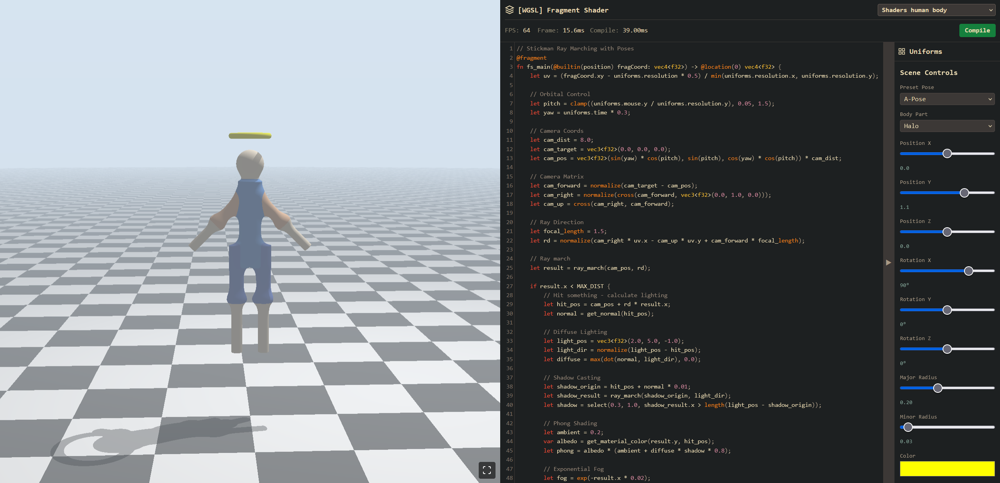

# WebGPU Interactive Ray Marching Scene Editor



## Live Demo

**[https://fab-pie.github.io/Shaders/](https://fab-pie.github.io/Shaders/)**

## Overview

An interactive 3D scene editor built with WebGPU and ray marching techniques. Edit and manipulate 3D primitives in real-time directly in your browser with live shader compilation and GPU-accelerated rendering.

## Features

- Real-time shader editing with syntax highlighting
- Interactive scene controls for manipulating 3D objects (position, rotation, size, color)
- GPU uniform buffer system for dynamic scene updates
- Orbital camera with mouse control
- Articulated stickman character with pose presets

## Tech Stack

- **WebGPU** - Modern GPU API for high-performance graphics
- **WGSL** - WebGPU Shading Language for shader programming
- **JavaScript** - Application logic and scene management
- **CodeMirror** - In-browser code editor
- **HTML/CSS** - User interface

## Local Development

### Requirements

- Python 3.x (for local server)
- A browser with WebGPU support (Chrome 113+, Edge 113+)

### Setup Instructions

1. Clone the repository:
   ```bash
   git clone https://github.com/fab-pie/Shaders.git
   cd Shaders
   ```

2. Start a local web server (required for WebGPU security policies):
   ```bash
   python -m http.server
   ```

3. Open your browser and navigate to:
   ```
   http://localhost:8000/Lecture04/
   ```

4. Select a shader from the dropdown menu and start experimenting.
